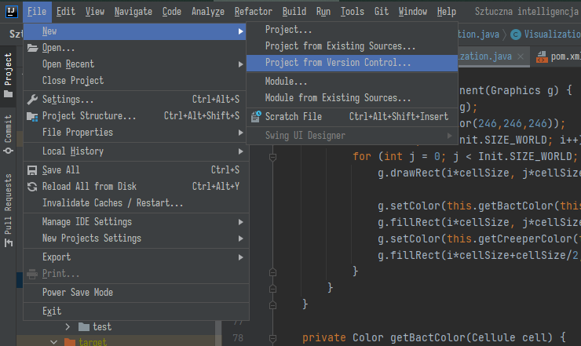
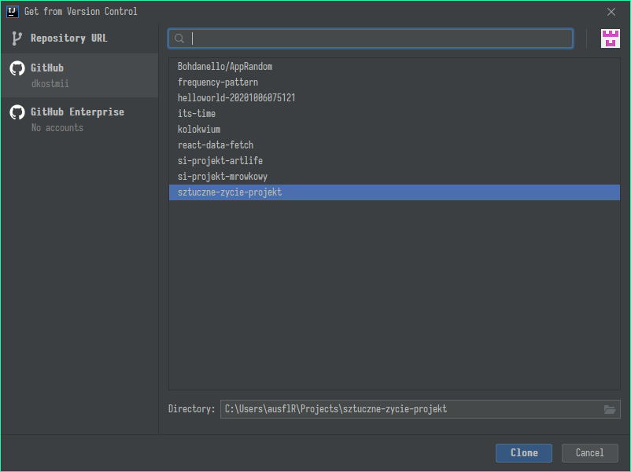
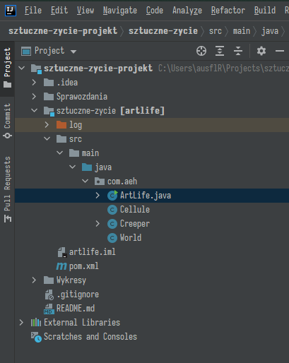
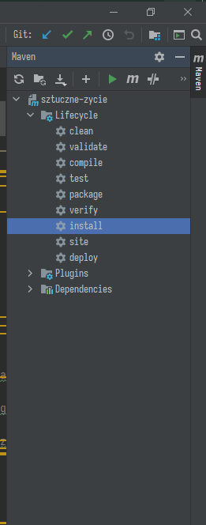
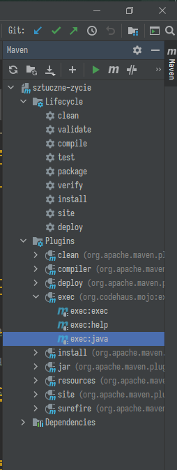
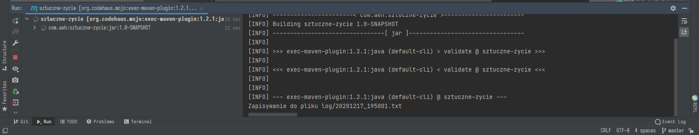
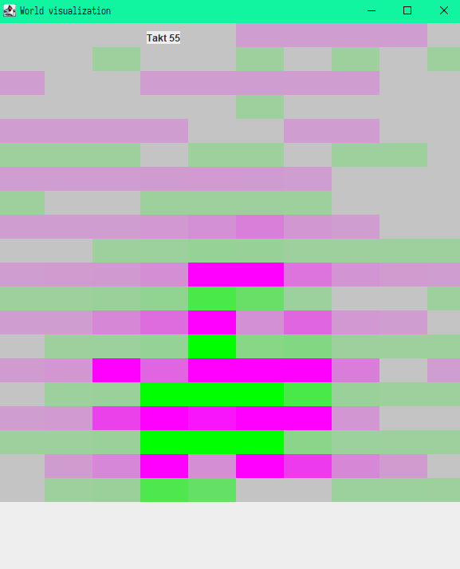
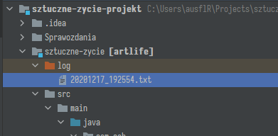
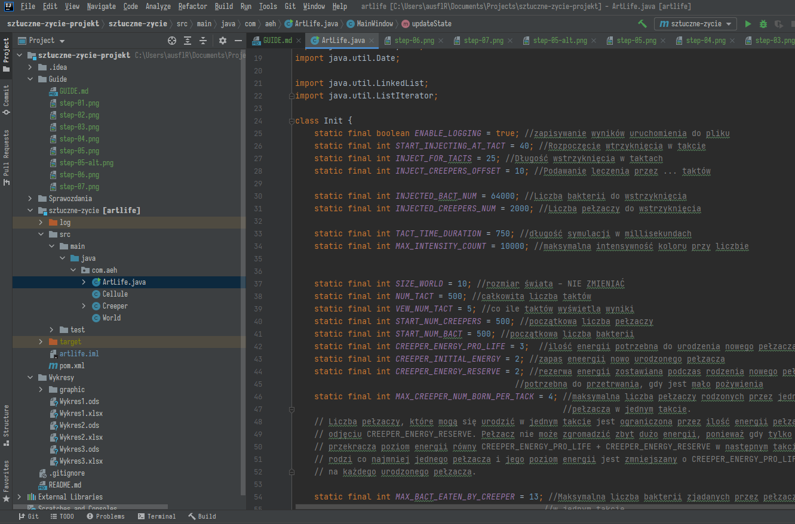

# Setup project in Intellij

1\. Firstly you must clone project

2\. Here you will login into your GitHub account and choose project you are invited in. **Alternatively** you can clone it via **Repository URL** and then proceed to login.

3\. Project structure looks like this

4\. Let's try _Maven_. Look at the ride side of IDE and locate the _**Maven panel**_. Then expand *Lifecycle folder* and locate **install** option. Start it by clicking green triangle.

5\. After you have done **install** lifecycle, expand *Plugins folder* and locate **exec:java** option. Start this one to run program.

6\. Wait a moment and window with graphics will pop up. 🟣 - bacteries, 🟢 - creepers

7\. You can find log files in *log* folder.

8\. All parameters you need are at the top of _**ArtLife.java**_ file

