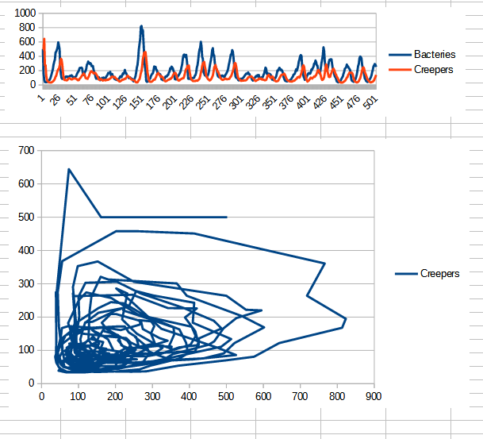

# Algorytm Sztuczne życie
## Spawozdanie. Etap 1

*Przygotował Dmytro Martsynenko*

Celem pierwszego etapu jest zapoznanie się z przedstawionym algorytmem oraz badanie wpływu poszczególnych parametrów na dynamikę liczby bakterii oraz pełzaczy.
Jaki stan systemu uważamay jako stabilny. Jest to taki stan, przy którym liczba bakterii nie przekracza 1 millionu, liczba każdego z oranizmów nie spada do zera oraz wahania tych liczb są w przedziale kilkuset.

## Wykresy:

### Wykres 1

Na pierwszym wykresie otrzymaliśmy skok liczby bakterii do ok. 10 tysięcy, ale został on zniwelowany przez pełzaczy, liczba który sięga ok. 5 tysięcy po kilkunastu taktów, dalej liczba obydwu ogranizmów trzyma się 300-500.

---

### Wykres 2

Na drugim wykresie zobaczymy cykliczne wahania ze średnią amplitudą ok. 400 bakterii oraz 200 pełzaczy. Także można zobaczyć modulacje takich wahań z okresem 300 taktów.

---

### Wykres 3

Na trzecim wykresie mamy skok liczby bakterii oraz pełzaczy do ok 4 tysięcy. Na początku są wahania 600-700 organizmów, od 76 taktu one maleją.

---

## Wniosek

Zmniejszenie początkowej liczby organizmów nie gwarantuje mniejsze wahania w systemie, ponieważ mocno wpływają na dynamikę współczynniki rozmnażania i rozprzestrzeniania bakterii oraz, aktywność pełzaczy, która zależy od orgraniczenia liczby urodzonych pełzaczy w takcie oraz od ograniczenia liczby zjedzonych bakterii prze pełzacza. Ponieważ reprezentacja bakterii oraz pełzaczy różni się, przeprowadzone badanie uwzględnia proces podbioru parametrów (znaleźć taki parametry dla *bakterii*, żeby były one równoważące parametrom dla *pełzaczy*).

