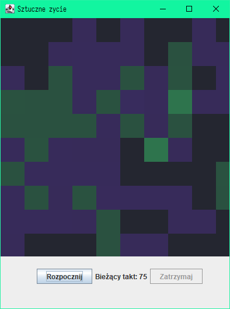
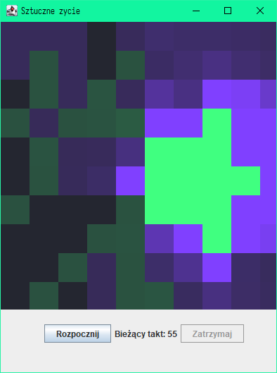
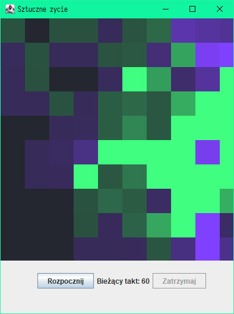
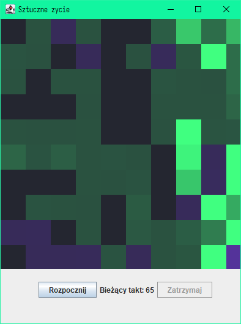

# Algorytm Sztuczne życie
## Spawozdanie. Etap 2

*Przygotował Dmytro Martsynenko*

Zadaniem drugiego etapu było dokonanie wtrzyknięcia dużej liczby bakterii do komórek świata, co odbywa się przy *zakażeniu* w rzeczywistości, dlatego dalej biędziemy nazywać *wstrzyknięcie bakterii* **zakażeniem.**
Po zakażeniu komórek świata należy podać niektórą ilość pełzaczy, co jest bardzo podobne do *podawania __leczenia__*. Dokonywać takiego leczenia należy przez niektóry czas, tak żeby zobaczyć efekt, ponieważ algorytm pobiera wyniki przy domyślnych ustawieniach *co 10 taktów*.
Zadaniem opcjonalnym jest implementacja świata w postaci graficznej, z symulacją w czasie rzeczywistym. Pozwala to lepiej zrozumieć zachowanie modelu *Drapieżniki i ofiary* w praktyce.

## Opis projektu

W celu implementacji zakażenia w symulowanym świecie, należy dokonać wyboru punktu wsztrzyknięcia. Najlepiej to zrobić przy pomocy losowania dwóch liczb odpowiadającym pozycji losowanego punktu.
Pojawiły się dodatkowe parametry, niezbędne do ustawienia parametrów zakażenia:
* Łączna liczba bakterii wykorzystanych przy zakażeniu - **INJECTED_BACT_NUM**
* Od którego takty zaczyna się wstrzyknięcie - **START_INJECTING_AT_TACT**
* Długość wstrzyknięcia - **INJECT_FOR_TACTS**

Także są parametry *leczenia*:
* Łączna liczba pełzaczy do leczenia - **INJECTED_CREEPERS_NUM**
* Przez ile taktów od początku zakażenia zacząć leczenie - **INJECT_CREEPERS_OFFSET**

Końcowa wersja projektu przedstawiona w postaci graficznej, która da możliwość zobaczyć proces zakażenia, a następnie działanie procesu lecznenia.

{ width=192px; }

Na _Rysynku 1_ przedstawiono wygląd okna symulacji po uruchomieniu programu. Fioletowym kolorem zaznaczono komórki swiata, w których liczba bakterii jest *większa od liczby pełzaczy*, a zielonym - *równa lub mniejsza*. W ciemniejszych komórkach liczba organizmów stanowi zero.

Żeby proces zakażenia oraz leczenia było łatwo zobaczyć, został dodany parametr **MAX_INTENSITY_COUNT**, który wyznacza maksymalną intensywność koloru dla komórki podawając pewną liczbę organizmów. Działa to w taki sposób, że dzielimy znaczenie alpha ustawionego koloru dla komórki przez **MAX_INTENSITY_COUNT**. Należy zwrócić uwagę, że na _Rysynku 1_ alpha jest znacznie mniejsza od 1.
<figure>
{ width=192px }
{ width=192px }

{ width=192px }
{ width=192px }

<figcaption>Rysunek 2: _Przykład uruchomienia symulacji (takty 50-65)_</figcaption>
</figure>

W danym przykładzie parametr **START_INJECTING_AT_TACT** ustawiono na **40**. Ale ponieważ zakażenie dopiero zaczyna się w tym takcie, zobaczymy efekt chociażby po kilku taktach, a w danym przypadku w takcie 45, bo ustawiliśmy parametr **VEW_NUM_TACT** na **5**, co znaczy, że aktualizujemy stan symulacji co 5 taktów.

Najbardziej znaczącymi taktami w danej symulacji są takty 50-65.
W takcie 50 rozszerza się obszar zakażenia, który na początku symulacji znajduje się w jednym punkcie.
W takcie 55 gwałtownie rośnie liczba pełzaczy, które wykonują funkcje obronną symulowanego orgranizmu.
W takcie 60 widać delokalizację całego procesu, zajmuje on prawie cały obszar świata, przewagę w liczbie trzymają pełzacze.
W takcie 65 liczba obu organizmów zaczyna się zmniejszać się, leczenie już się zakończyło.

<figure>


<figcaption>Rysunek 3: _Koniec procesów zakażenia oraz leczenia_</figcaption>
</figure>

Na powyższym zrzucie zobaczymy stan świata w *takcie 70*. Niczym się nie różni on od stanu stabilnego

```
  PARAMETRY URUCHOMIENIA
_____________________________________________________
  Całkowita liczba taktów  
_____________________________________________________
  500

_____________________________________________________
  Wyświetlaj wyniki co  
_____________________________________________________
  5 taktów

_____________________________________________________
  Początkowa liczba pełzaczy  
_____________________________________________________
  500

_____________________________________________________
  Początkowa liczba bakterii  
_____________________________________________________
  500

_____________________________________________________
  Liczba energii do urodzenia pełzacza  
_____________________________________________________
  3

_____________________________________________________
  Zapas energii nowourodzonego pełzacza  
_____________________________________________________
  2

_____________________________________________________
  Rezerwa energii zostawiana po urodz. pełzacza  
_____________________________________________________
  2

_____________________________________________________
  Max. pełzaczy w 1 takcie  
_____________________________________________________
  4

_____________________________________________________
  Max. bakterii do zjedz. przez pełzacza w 1 takcie  
_____________________________________________________
  13

_____________________________________________________
  Współczynnik rozmnażania bakterii  
_____________________________________________________
  0,50

_____________________________________________________
  Współczynnik rozprzestrzeniania bakterii  
_____________________________________________________
  0,60

_____________________________________________________
  Początek wstrzyknięcia w  
_____________________________________________________
  40 takcie

_____________________________________________________
  Długość wstrzyknięcia  
_____________________________________________________
  25 takty/-ów

_____________________________________________________
  Wstrzyknięcie pełzaczy przez  
_____________________________________________________
  10 takty/taktów

_____________________________________________________
  Liczba bakterii do wstrzyknięcia  
_____________________________________________________
  32000

_____________________________________________________
  Liczba pełzaczy do wstrzyknięcia  
_____________________________________________________
  4000
```

\

Podsumowując otrzymane wyniki, z pewnością możemy stwierdzić, że przy pomocy parametrów możemy dość realistycznie zamodelować rzeczywiste procesy, w tym *zakażenie* organizmu oraz jego *leczenie*. Wykonanie tego projektu pozwala zrozumieć jak wykorzystać język Java oraz narzędzie do automatyzacji budowania projektów Maven dla realizacji zadań.
